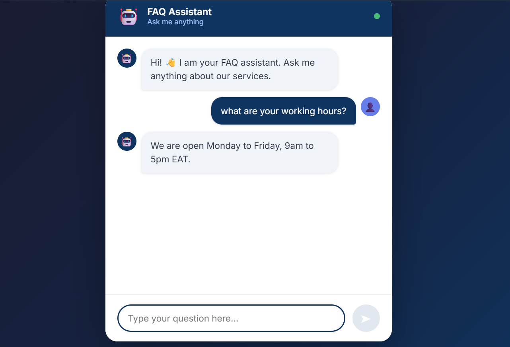

# FAQ Chatbot

An intelligent FAQ chatbot that matches user questions to the most relevant answer using NLP techniques.

## Live Demo

🔗 [View Live App](https://code-alpha-chatbot-chi.vercel.app)

🔗 [Backend API](https://codealpha-chatbot-api.onrender.com)

## Screenshot



## How It Works

1. User types a question
2. Backend preprocesses the text using NLTK
3. TF-IDF vectorization converts text to numbers
4. Cosine similarity finds the closest matching FAQ
5. The best matching answer is returned to the user

## Tech Stack

### Frontend

- React + TypeScript
- Vite

### Backend

- Python + Flask
- NLTK — text preprocessing
- scikit-learn — TF-IDF vectorization and cosine similarity

## How to Run

### Backend

```bash
cd backend
python -m venv venv
venv\Scripts\activate
pip install -r requirements.txt
python app.py
```

### Frontend

```bash
cd frontend
npm install
npm run dev
```
